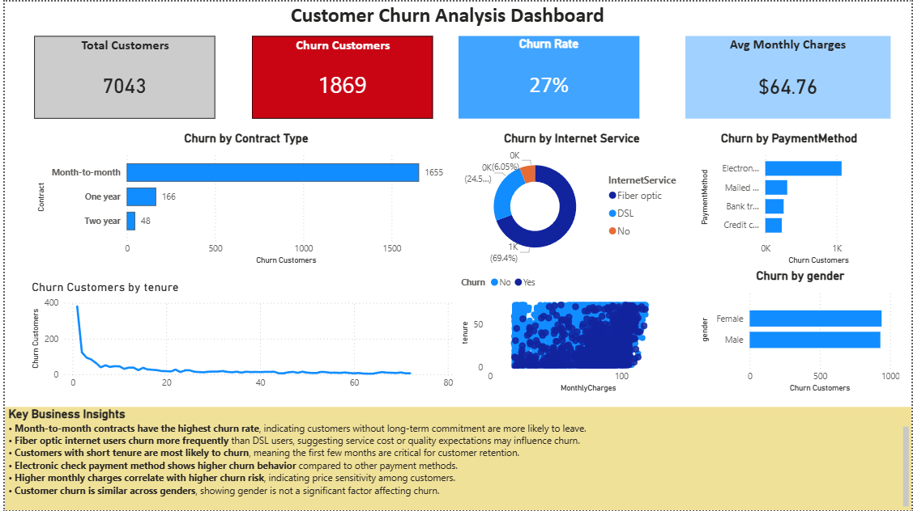

# Customer Churn Analysis Dashboard

This Power BI dashboard analyzes telecom customer churn patterns and identifies key drivers of customer attrition.

## Dashboard Preview

## Tools Used
Power BI
DAX
Data Modeling

## Key Business Insights
- Month-to-month contracts show the highest churn rate.
- Fiber optic customers churn more frequently than DSL users.
- Customers with short tenure are most likely to leave.
- Electronic check payment method shows higher churn behavior.
- Higher monthly charges correlate with higher churn risk.
- Customer churn is similar across genders.
